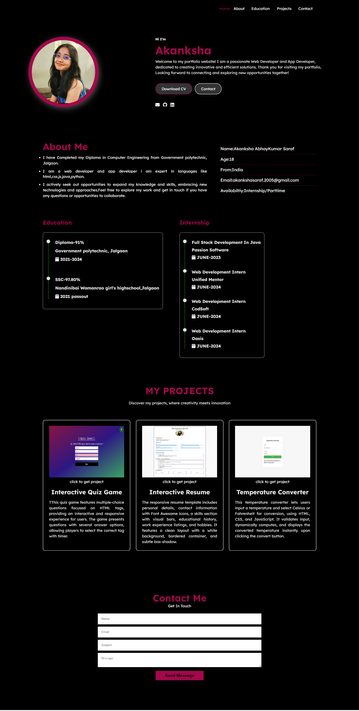

 ## Description

This project is a personal portfolio website for a web developer and app developer. It includes sections for Home, About, Education, Projects, and Contact. The Home section features a profile photo, introduction, and links to the resume and contact. The About section provides details about the developer's background and skills, while the Education and Internship sections outline academic and professional experiences. The Projects section showcases the developer's work, and the Contact section allows visitors to send messages directly through the site.

# Screenshots

## Features

- Clean and responsive design
- Skills section with animated skill bars
- Contact information with icons
- Education and work experience sections
- Hobbies section with interactive hover effects

## Author

Akanksha Saraf

